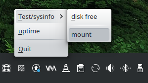

# traymenu
A Gtk/Qt-based menu for the system tray to execute arbitrary commands.

It takes some inspiration from the "alltray" tool
(https://alltray.sourceforge.net/, https://linux.die.net/man/1/alltray).

*What does it look like?*

Screenshot in Kubuntu, using the Qt menu:
```
CMD_TERM="xterm -geometry 80x30 -hold -bg black -fg green -e"
traymenu \
    qt --debug \
    --submenu "Test/sysinfo" \
        --item "disk free: $CMD_TERM df" \
        --separator \
        --item "mount: $CMD_TERM mount" \
        --end \
    --item "uptime: $CMD_TERM uptime" \
        --end
```



*Help!?*

```
$ traymenu
First argument must be 'qt' or 'gtk'

Usage: {sys.argv[0]} qt|gtk [-d|--debug]
                 --icon <filename>
               { --item '<label>: <command>' | --separator |
               { --submenu <label> | --end }
```
